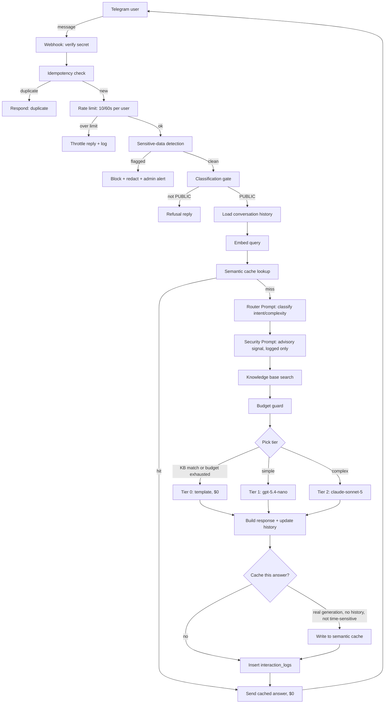

# AI Community Agent

A self-improving 1:1 AI assistant (Telegram for the MVP) for an internal AI/dev community, plus
a separate human-run WhatsApp Community (unrelated infra, not built here). Source of truth for
scope, architecture, and rules: [`docs/project_setup/PROJECT-SPEC.md`](docs/project_setup/PROJECT-SPEC.md).

## Status

Tracked against [`PROJECT-SPEC.md` §24](docs/project_setup/PROJECT-SPEC.md)'s own phase list.

| Phase | What it is | Status |
|---|---|---|
| 0-3 | Architecture docs, local infra, database schema, messaging pipe | Done |
| 4 | Agent Core: language detection, classification, sensitive-data detection, RAG, budget guard, three-tier generation, rate limit, semantic cache, intent router | Done |
| 5 | Prompt System: Base/Router/Security prompts live; Evaluator/Digest stored, awaiting a consumer | Done |
| 6 | LDD: telemetry, feedback, evaluator loop, golden-eval, human approval, rollback | Not started |
| 7 | Weekly Community Automation: digest, knowledge-gap report, cost report | Not started |
| 8-9 | Pilot, Expansion | Not started |

The bot is live and answering real questions over Telegram right now. See
[`CLAUDE.md`](CLAUDE.md) for day-to-day working conventions and load-bearing design decisions
(kept more current than this file for that level of detail).

## What it does

- **Answers questions** in Hebrew or English, mirroring whichever language the user writes in
  (keeping a fixed list of technical terms in English), with a persona tuned for an Israeli
  AI/dev community: warm, direct, patient with beginners, concise (chat-length replies, not
  articles).
- **Searches a curated knowledge base** (`knowledge_base`, pgvector similarity search) before
  generating an answer, and cites the source when it finds a real match instead of guessing.
- **Routes each message to the cheapest model that can handle it**: a template/KB-match
  response costs nothing, simple questions go to a fast/cheap model (`gpt-5.4-nano`), harder
  ones escalate to a stronger model (`claude-sonnet-5`) - decided by a real LLM classification
  call (the Router Prompt), not a hardcoded rule.
- **Remembers the last few turns** of a conversation (Redis, 30 min TTL) so follow-up questions
  make sense without re-explaining context.
- **Caches near-duplicate answers** (pgvector semantic cache, $0 on a hit) so asking the same
  thing twice doesn't cost anything the second time.
- **Enforces a budget**: tracks real token cost per interaction, and throttles down to
  templates-only if a configured monthly/daily budget is close to or over the line.
- **Rate-limits abusive bursts** per user (10 messages/60s, fails open if Redis is briefly down).
- **Screens every message before it reaches any LLM**: blocks and redacts anything that looks
  like a credential/secret, alerts an admin, and never stores the raw sensitive text.
- **Logs a security-sensitivity signal** (PUBLIC/INTERNAL/SENSITIVE/CLASSIFIED, via a real LLM
  call) on every interaction for future review - advisory only right now, doesn't block
  anything yet.
- **Logs everything** (`interaction_logs`): query, response, model used, tokens, real cost,
  cache hit/miss, security signals, retrieved KB sources, which prompt version answered - the
  foundation for the self-improving loop that Phase 6 builds.

## Flow diagram



Full annotated version with exact node names: [`docs/architecture/data-flow.md`](docs/architecture/data-flow.md)
and [`docs/project_setup/ARCHITECTURE-FLOWS.md`](docs/project_setup/ARCHITECTURE-FLOWS.md). The
literal implementation is [`n8n/workflows/telegram-echo-bot.json`](n8n/workflows/telegram-echo-bot.json)
(hand-authored JSON, no browser UI is used - see
[`.claude/skills/n8n-workflow-authoring/SKILL.md`](.claude/skills/n8n-workflow-authoring/SKILL.md)).

## Services

| Service | Image | Role |
|---|---|---|
| `postgres` | `pgvector/pgvector:pg16` | System of record - all app data, plus pgvector for embeddings (ADR-0002). Port `5432`. |
| `redis` | `redis:7-alpine` | Cache/session/rate-limit/idempotency only, never authoritative (ADR-0002). Port `6379`. |
| `n8n` | `n8nio/n8n:latest` | Workflow engine that IS the application - the whole pipeline above is one n8n workflow. Not published directly to the host. |
| `reverse-proxy` | `caddy:2-alpine` | Fronts n8n. Published on host port `5678`. |

An external `cloudflared` tunnel (run manually, not part of `docker-compose.yml`) exposes
`localhost:5678` to the internet so Telegram's servers can reach it - see "Troubleshooting: the
bot isn't responding" below.

## Local development

Prerequisites: [Homebrew](https://brew.sh), [Colima](https://github.com/abiosoft/colima) (not
Docker Desktop - see [ADR-0005](docs/architecture/adrs/0005-local-docker-runtime.md)).

```sh
# First time only
brew install colima docker docker-compose dbmate
cp .env.example .env   # fill in real values - see docs/project_setup/PREREQUISITES.md

# Every session
colima start
./scripts/dev-up.sh    # starts Postgres+pgvector, Redis, n8n, Caddy; waits for healthy
dbmate up               # apply any new migrations
```

n8n itself is reachable at `http://localhost:5678` (through Caddy), but there's no browser UI
workflow to click through - workflows are authored as JSON and imported via the n8n CLI. To
deploy a change to `n8n/workflows/telegram-echo-bot.json`:

```sh
docker compose cp n8n/workflows/telegram-echo-bot.json n8n:/tmp/telegram-echo-bot.json
docker compose exec -T n8n n8n import:workflow --input=/tmp/telegram-echo-bot.json
docker compose exec -T n8n n8n publish:workflow --id=telegram-echo-bot-phase3
docker compose restart n8n   # webhook routes only register at process startup
```

## Common commands

| Command | What it does |
|---|---|
| `./scripts/dev-up.sh` | Start Colima (if needed) + all services, wait for healthy |
| `./scripts/dev-status.sh` | Point-in-time health check: Docker, each service, git, and whether the public webhook tunnel is actually reachable by Telegram |
| `./scripts/verify-all.sh` | Full pre-merge gate: infra health, `docker compose config`, `dbmate status`, then every component's `tests/run.sh` |
| `dbmate up` / `dbmate down` / `dbmate status` | Apply / roll back / check migration state |
| `dbmate dump` | Regenerate `database/schema.sql` after a migration (needs `pg_dump`: `export PATH="/opt/homebrew/opt/libpq/bin:$PATH"`) |
| `docker compose ps` | Container status |
| `docker compose logs n8n --tail 100` | Recent n8n logs (execution errors, API rejections) |
| `docker compose restart n8n` | Restart n8n (needed after importing a workflow change) |

## Viewing DB data

```sh
PG_USER=$(grep -E '^POSTGRES_USER=' .env | cut -d= -f2-)
PG_DB=$(grep -E '^POSTGRES_DB=' .env | cut -d= -f2-)
docker compose exec -T postgres psql -U "$PG_USER" -d "$PG_DB"
```

(Never `cat .env` directly - the grep+cut pattern above avoids ever printing its full contents.)

Once connected, or via `-c "<query>"` on the command above:

```sql
-- Recent conversations, what model answered, cost, whether it was a cache hit
SELECT platform_user_id, user_query, routed_model, intent, cache_hit, cost_usd, created_at
FROM interaction_logs ORDER BY created_at DESC LIMIT 20;

-- Today's spend vs budget
SELECT SUM(cost_usd) AS today_cost FROM interaction_logs
WHERE created_at >= date_trunc('day', now());
SELECT * FROM budget_policy;

-- What's active in the knowledge base
SELECT category, title, status FROM knowledge_base ORDER BY category;

-- Which prompt version answered, and what's currently active per type
SELECT prompt_type, version_tag, is_active FROM system_prompts ORDER BY prompt_type;

-- Sensitive-data incidents (never shows the raw flagged text, only metadata)
SELECT platform_user_id, category, detector, created_at FROM sensitive_data_events
ORDER BY created_at DESC LIMIT 20;

-- Semantic cache contents and hit counts
SELECT query_text, hit_count, created_at, expires_at FROM semantic_cache
ORDER BY created_at DESC LIMIT 20;
```

All 13 tables: `\dt` once connected, or see [`database/schema.sql`](database/schema.sql) for
the full current schema.

## Configuration (`model_registry` / `budget_policy`)

Real, currently-seeded values (not placeholders) - `database/seed/model-registry.sql` and
`database/seed/budget-policy.sql`:

| Tier | Provider | Model | Input / output ($ per 1M tokens) |
|---|---|---|---|
| Embedding | OpenAI | `text-embedding-3-small` | $0.02 / - |
| 1 (fast/cheap) | OpenAI | `gpt-5.4-nano` | $0.20 / $1.25 |
| 2 (escalation) | Anthropic | `claude-sonnet-5` | $2.00 / $10.00 |

Budget: $20/month, $1/day, warning at 70% consumed, hard stop at 100% (fails safe to hard-stop
if the policy table is ever empty - never assumes unlimited budget).

## Project structure

```
n8n/workflows/                         the application - the whole pipeline as one n8n workflow
n8n/tests/                             end-to-end regression tests against the live webhook
database/migrations/                   dbmate schema migrations (source of truth: database/schema.sql)
database/seed/                         idempotent seed data (model pricing, budget policy, system prompts)
database/tests/                        schema/constraint regression tests
knowledge/                             KB ingestion (OpenAI embeddings) + pgvector literal formatting
security/classification/               PUBLIC/INTERNAL/SENSITIVE/CLASSIFIED decision (currently a stub)
security/sensitive-data-detection/     the real, always-on pre-LLM credential/secret detector
services/messaging-adapters/telegram/  Telegram-specific normalize/format logic (mirrors the n8n Code nodes)
shared/                                channel-agnostic utilities (e.g. language detection)
docs/architecture/                     ADRs, threat model, data-flow, MVP scope
docs/project_setup/                    the full product spec, architecture flows, prerequisites
scripts/                               dev-up / dev-status / verify-all
```

Each `<component>/tests/` directory has its own `run.sh`
(or a Node `--test` suite via `npm test`, for the TypeScript-only components) -
`./scripts/verify-all.sh` auto-discovers and runs all of them; a new phase adding a new
component just needs to add its own `tests/run.sh` to be covered automatically.

## Troubleshooting: the bot isn't responding

The bot's public reachability depends on an external tunnel this repo doesn't manage
(`cloudflared tunnel --url http://localhost:5678`, run manually in a separate terminal -
free/ephemeral quick tunnels are known to drop and get a new random URL on restart).
`./scripts/dev-status.sh` checks this specifically (added after this exact failure mode cost
real debugging time once) - if it reports the tunnel unreachable:

```sh
# 1. Restart the tunnel, note the new https://....trycloudflare.com URL it prints
cloudflared tunnel --url http://localhost:5678

# 2. Point .env at the new URL (without ever printing the file's contents)
sed -i '' 's|^WEBHOOK_URL=.*|WEBHOOK_URL=https://<new-url>|' .env

# 3. Re-register the new URL with Telegram (needs your bot token, run this yourself)
source .env && curl -s -X POST "https://api.telegram.org/bot${TELEGRAM_BOT_TOKEN}/setWebhook" \
  -d "url=${WEBHOOK_URL}/webhook/telegram-echo-bot-phase3/webhook/telegram-webhook" \
  -d "secret_token=${TELEGRAM_WEBHOOK_SECRET}"
```

Should return `{"ok":true,"result":true,"description":"Webhook was set"}`.

## Full docs

- [`docs/project_setup/PROJECT-SPEC.md`](docs/project_setup/PROJECT-SPEC.md) - product spec, security model, architecture, phases (source of truth).
- [`docs/project_setup/ARCHITECTURE-FLOWS.md`](docs/project_setup/ARCHITECTURE-FLOWS.md) - diagrams, ERD, sequence flows.
- [`docs/project_setup/PREPARATION-CHECKLIST.md`](docs/project_setup/PREPARATION-CHECKLIST.md) - preparation phases and the First Implementation Gate.
- [`docs/architecture/`](docs/architecture/) - ADRs, threat model, data-flow, MVP scope.
- [`CLAUDE.md`](CLAUDE.md) - day-to-day working conventions, load-bearing design decisions, kept current phase-by-phase.

## Security note

`.env` and `docs/links_and_details.md` contain live credentials/IDs and are gitignored - never
remove either from `.gitignore`, and never put secrets in any other tracked file. See
[`PROJECT-SPEC.md` §4.3](docs/project_setup/PROJECT-SPEC.md).
