System Architecture, Schema & Flows - Self-Improving AI Community Agent
Companion to: PROJECT-SPEC.md
Purpose: visual and technical reference for Cursor
Status: Updated after Meta Developer Account SMS-verification blocker - Agent channel decoupled from WhatsApp

## 0. Channel Decision (Update)

Two separate, independent surfaces exist in this system. They do **not** share an onboarding
path, an API, or a blocker:

```text
SURFACE 1 - Human Community           SURFACE 2 - Agent (1:1 assistant)
WhatsApp Community                    Telegram Bot (primary, MVP)
Created via regular WhatsApp app      Created via @BotFather
(NOT WhatsApp Business app -          No Meta Developer Account needed
 Communities unsupported there)       No SMS verification needed
Owned by a trusted household          WhatsApp Cloud API (future/optional,
member's regular account, with        once Meta Developer Account unblocks,
project owner added as full admin     using the WhatsApp Business number)
No Meta Developer Account needed
No SMS verification needed
Human-administered, always
```

Rationale: the Meta Developer Account SMS-verification flow blocked creation of a WhatsApp
Business number for the Agent. That blocker has **no effect** on creating a WhatsApp
Community - Communities are a native WhatsApp-app feature with no developer/API dependency.
Separately, WhatsApp Communities are not available inside the WhatsApp Business app at all
(a platform limitation, not a blocker) - so the Community is created from a regular WhatsApp
account, with the project owner added as a full admin immediately after creation for
continuity of control. The Agent side is rebuilt around a **messaging-adapter abstraction**,
with Telegram Bot API as the concrete adapter for the MVP, and WhatsApp Cloud API as a second
adapter to be added later without touching any downstream logic (security, RAG, cost
routing, LDD).

This means: build and validate the entire system now. Swap or add the WhatsApp Cloud API
adapter later as a drop-in, once Meta unblocks - it changes one node group in n8n, nothing else.

## 1. Core Architecture

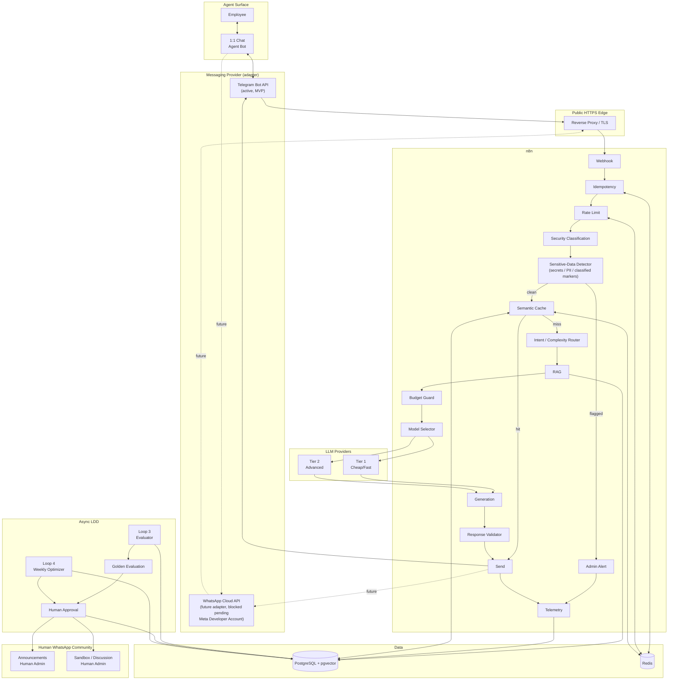

Hard boundary (unchanged)
The Agent does not post directly into ANN or SANDBOX, regardless of which messaging adapter
it uses.
The administrator is the publication gate.

Adapter boundary (new)
The Messaging Provider subgraph is the only place channel-specific code lives. Everything
below the `WH["Webhook"]` node is channel-agnostic - it must never contain Telegram- or
WhatsApp-specific logic. n8n implements this as a small "normalize inbound message" /
"format outbound message" sub-workflow pair per adapter, both producing/consuming the same
internal message shape.

## 2. Trust Boundaries

```text
TRUST BOUNDARY A
User / Messaging App (Telegram now, WhatsApp later)
|
v
-------------------------------
External Messaging Boundary
-------------------------------
|
v
n8n
|
+----------------------+
| |
v v
PostgreSQL Redis
|
v
-------------------------------
External AI Boundary
-------------------------------
|
+--> Tier 1 Provider
|
+--> Tier 2 Provider
```

Security classification, and now the sensitive-data detector, must both complete before
crossing the external AI boundary - independent of which messaging boundary the message
arrived through.

## 3. Database ERD

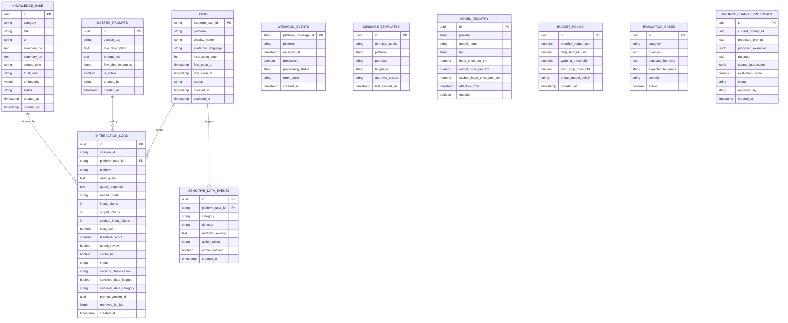

Changes from the original design:
- `whatsapp_id` renamed to `platform_user_id` with a companion `platform` column
  (`telegram` | `whatsapp`), everywhere it appeared, so the schema is channel-agnostic.
- New `SENSITIVE_DATA_EVENTS` table: a dedicated, append-only log of every time the
  sensitive-data detector fires, separate from general interaction telemetry, so it can be
  reviewed/audited on its own and never silently mixed into normal logs.
- `INTERACTION_LOGS` gains `sensitive_data_flagged` and `sensitive_data_category` so the
  detector's verdict is visible directly on the interaction row too.

knowledge_base and prompt relationships in interaction_logs remain logical references stored
as IDs/JSONB because one response may use multiple KB records.

## 4. Loop 1 - Real-Time Sequence

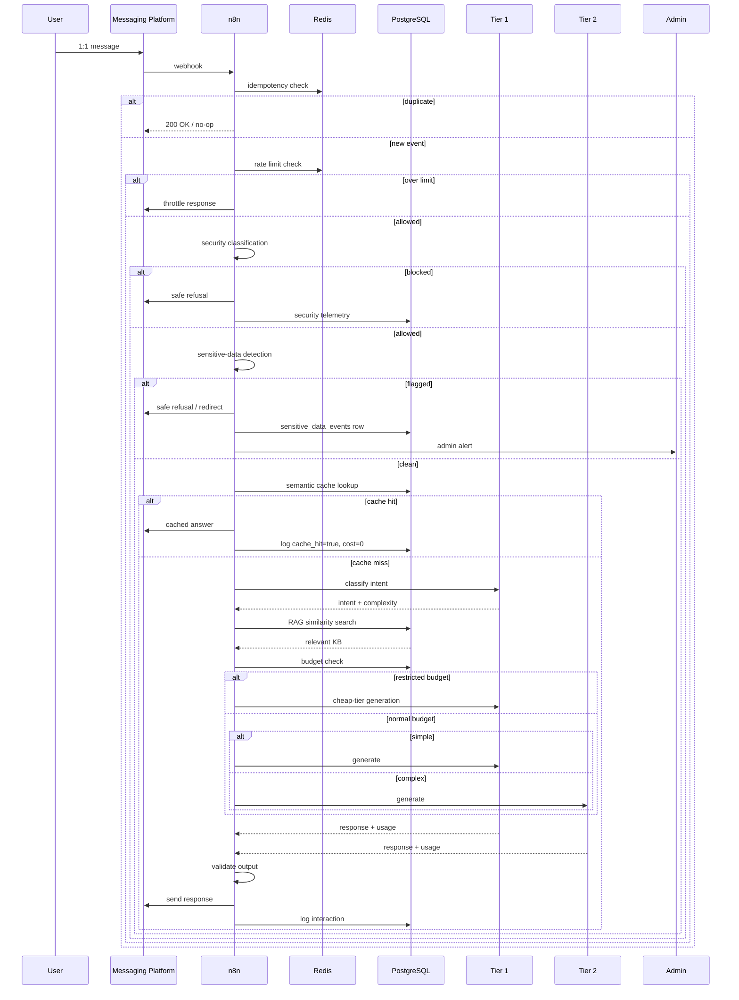

## 5. State Machine - User Message

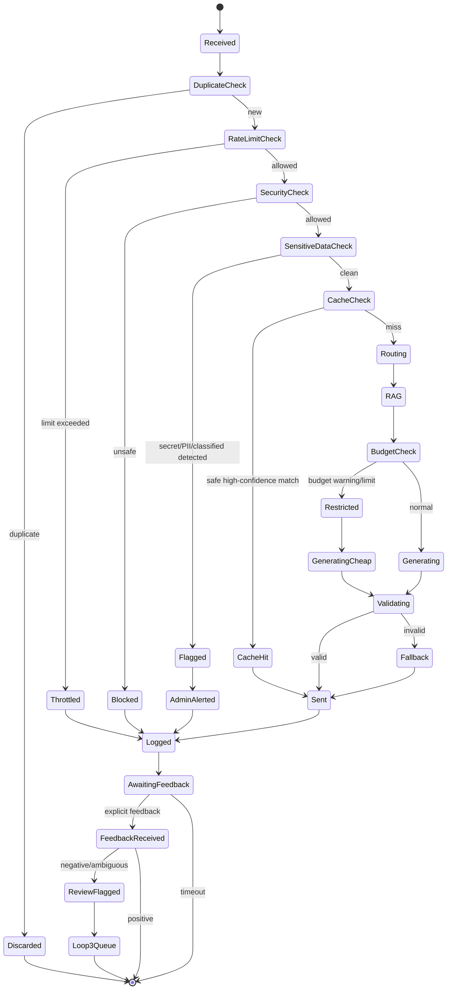

## 6. Loop 2 - Telemetry & Feedback

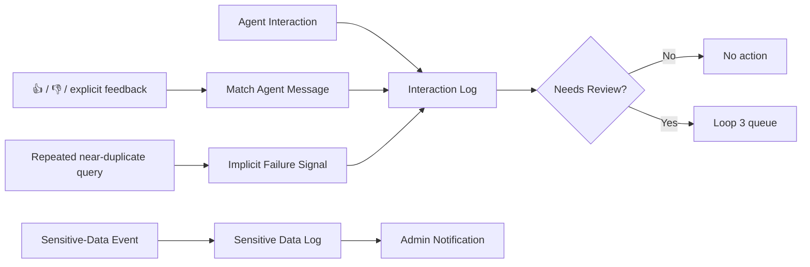

Important:
Implicit feedback is evidence, not proof. Sensitive-data events are never fed into Loop 3 as
training signal - they go to the admin only, kept in a separate audit trail.

## 7. Loop 3 - Meta-Learning

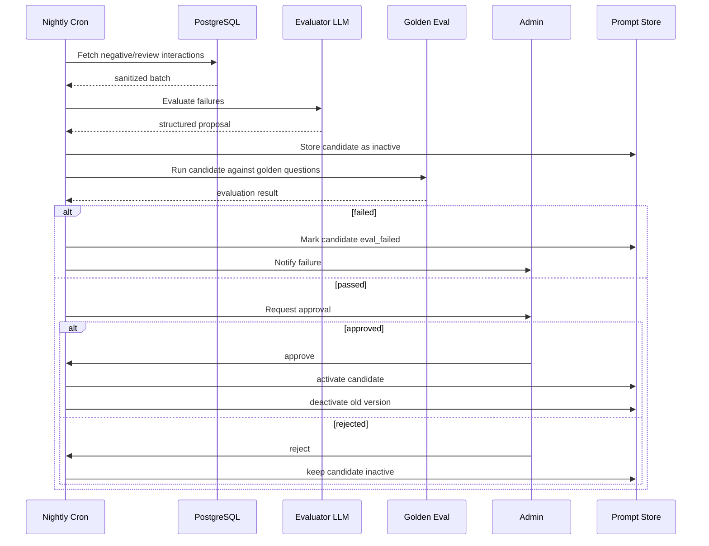

The evaluator cannot activate itself.

## 8. Prompt Lifecycle

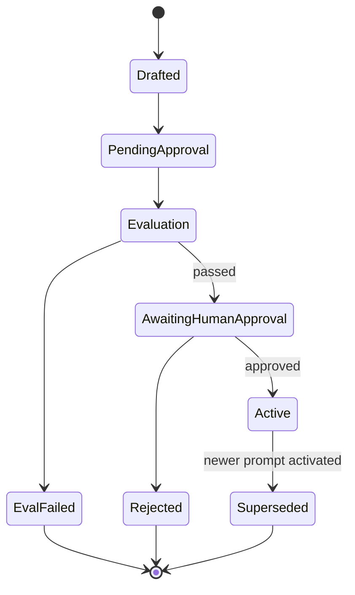

Never delete historical prompt versions.

## 9. Loop 4 - Weekly Optimization

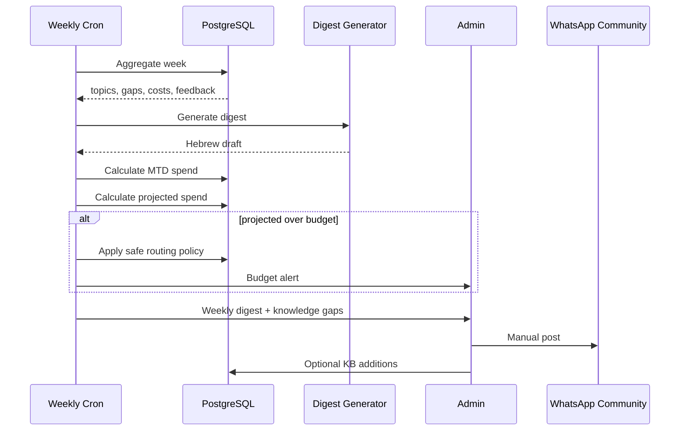

Note: the weekly digest is posted into the WhatsApp Community regardless of which platform
the Agent itself runs on - the Community stays WhatsApp-native at all times.

## 10. Cost Routing

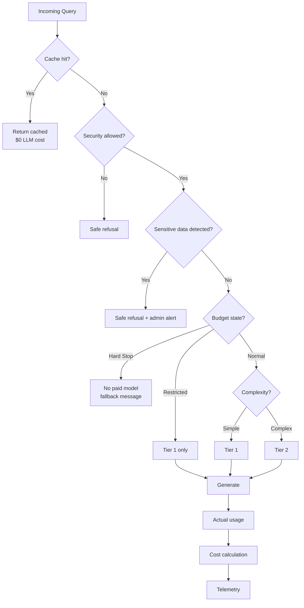

## 11. Deployment Topology

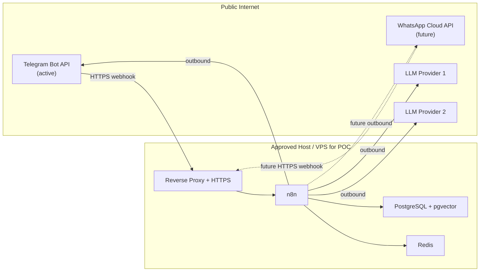

A laptop may be used for development.
A production webhook requires a publicly reachable HTTPS endpoint - true for both Telegram
Bot API and WhatsApp Cloud API.

## 12. Failure Paths

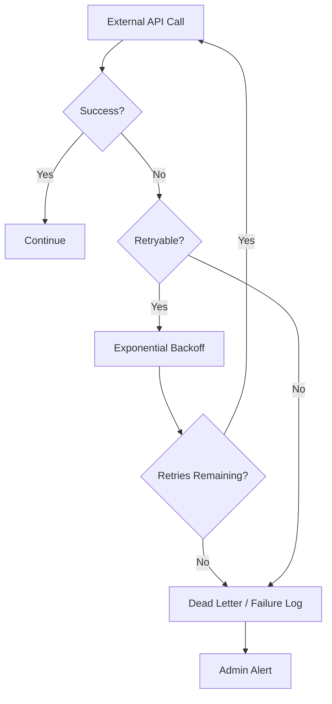

## 13. Security Flow (Updated)

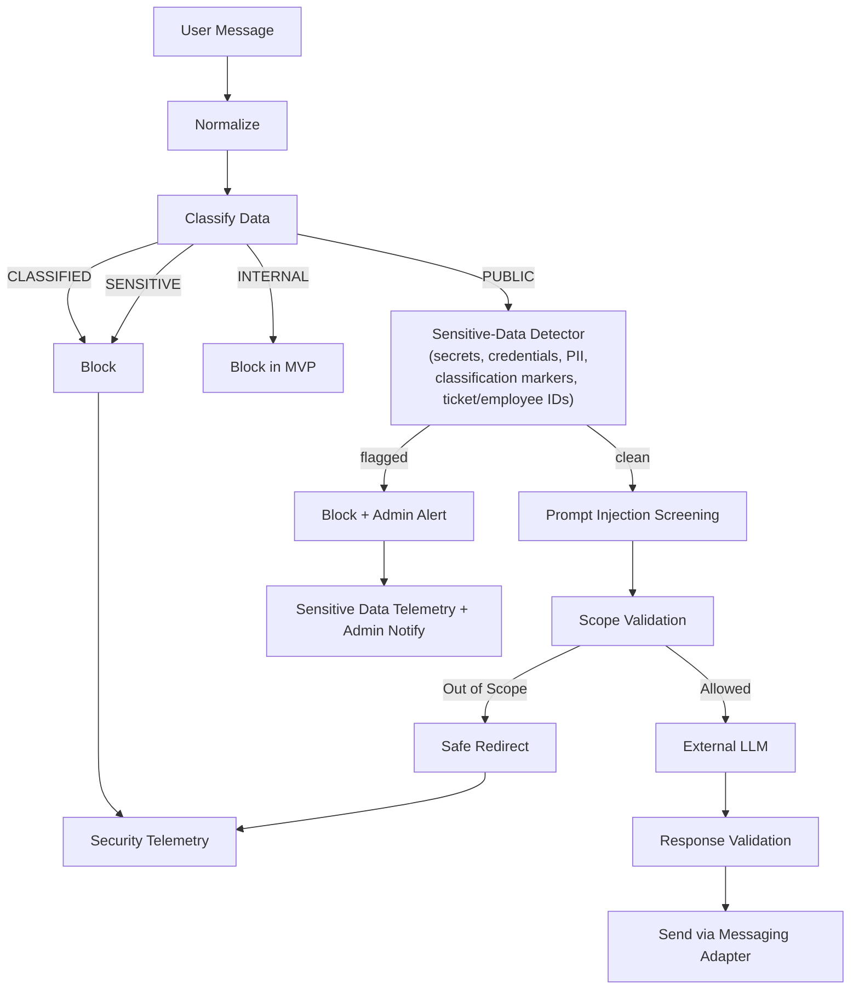

The sensitive-data detector is a distinct step from data classification: classification
decides whether content is allowed to leave the trust boundary; the detector specifically
looks for things a user typed that they should not have typed at all (secrets, credentials,
personal data, anything resembling classified markings), and its firing is always
admin-visible, not just logged.

## 14. Security Design Principle

Do not implement:
```text
Regex == DLP
```
Implement:
```text
Heuristics
+
Policy
+
Data classification
+
Sensitive-data detection (secrets/PII/classified markers)
+
Least privilege
+
Human review
+
Provider controls
```

The POC should remain public-data-only until the organization approves a production data-flow
architecture. This holds regardless of which messaging platform is in front of it.

## 15. Model Registry

The workflows should not contain logic like:
```text
if complex:
use claude-3.5-sonnet
```
Instead:
```text
Router
|
v
model_registry
|
+--> provider
+--> model
+--> tier
+--> pricing
+--> enabled
```
This allows model replacement without rewriting workflows.

## 16. Golden Evaluation Set

Minimum categories:
1. AI basics
2. RAG
3. Agents
4. Copilot
5. AI development
6. Podcasts
7. AGI
8. Hebrew response
9. English response
10. Heblish terminology
11. Security refusal
12. Prompt injection
13. Out-of-scope question
14. Unknown knowledge
15. Budget-restricted behavior
16. Sensitive-data / secret-leak attempt (new)

Each candidate prompt must be evaluated against the same baseline, on whichever platform the
Agent is currently running.

## 17. MVP Validation

The MVP is successful when:
```text
Telegram DM (or WhatsApp DM once available)
|
v
Webhook
|
v
Idempotency
|
v
Security Classification
|
v
Sensitive-Data Detection
|
v
Cache / Router / RAG / Budget
|
v
Response
|
v
Telemetry
|
v
Feedback
|
v
LDD proposal
|
v
Golden Eval
|
v
Human Approval
```

And the weekly output is:
```text
Agent
|
+--> weekly content
+--> knowledge gaps
+--> cost report
+--> quality report
+--> sensitive-data incident summary
|
v
Admin
|
v
WhatsApp Community (human-run, unchanged)
```
